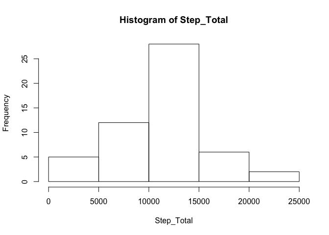

# Reproducible Research: Peer Assessment 1


## Loading and preprocessing the data
### 1) Load the data

```r
df.activity <- read.csv("/Users/wytworm/GitHub/RepData_PeerAssessment1/activity.csv",colClasses = c("numeric", "character", 
    "numeric"))
```

## What is mean total number of steps taken per day?
### 1) Calculate the total number of steps taken per day

```r
df.ttl_steps <- aggregate(steps ~ date, df.activity, sum)
```
### 2) Make a histogram of the total number of steps taken each day

```r
Step_Total <-df.ttl_steps$steps
hist(Step_Total)
```

 
  
### 3) Calculate and report the mean and median of the total number of steps taken per day

```r
step.mean <- mean(Step_Total)
step.mean
```

```
## [1] 10766.19
```

```r
step.median <- median(Step_Total)
step.median
```

```
## [1] 10765
```

## What is the average daily activity pattern?
### Make a time series plot (i.e. type = "l") of the 5-minute interval (x-axis) and the average number of steps taken, averaged across all days (y-axis)

```r
time_series <- tapply(df.activity$steps, df.activity$interval, mean, na.rm = TRUE)
plot(row.names(time_series), time_series, type = "l", xlab = "5-minute interval", 
    ylab = "averaged across all days", main = "average number of steps taken")
```

 
 
### Which 5-minute interval, on average across all the days in the dataset, contains the maximum number of steps?  

```r
names(which.max(time_series))
```

```
## [1] "835"
```
## Imputing missing values
### Calculate and report the total number of missing values in the dataset (i.e. the total number of rows with NAs)

```r
na.count <- length(which(is.na(df.activity)))
na.count
```

```
## [1] 2304
```

### Create a new dataset that is equal to the original dataset but with the missing data filled in.
#### Replace NA by mean

```r
avg_steps_by_interval <- aggregate(steps ~ interval, data = df.activity, FUN = mean)
imputed_values <- numeric()
for (i in 1:nrow(df.activity)) {
    cell <- df.activity[i, ]
    if (is.na(cell$steps)) {
        steps <- subset(avg_steps_by_interval, interval == cell$interval)$steps
    } else {
        steps <- cell$steps
    }
    imputed_values<- c(imputed_values, steps)
}
df.activity.imputed <- df.activity
df.activity.imputed$steps <- imputed_values
```
## Are there differences in activity patterns between weekdays and weekends?
### Make a histogram of the total number of steps taken each day 

```r
df_imputed.ttl_steps <- aggregate(steps ~ date, df.activity.imputed, sum)
Step_Total_Imputed <-df_imputed.ttl_steps$steps
hist(Step_Total_Imputed)
```

 
 
### Calculate and report the mean and median total number of steps taken per day.

```r
step.mean.imputed <- mean(Step_Total_Imputed)
step.mean.imputed
```

```
## [1] 10766.19
```

```r
step.median.imputed <- median(Step_Total_Imputed)
step.median.imputed
```

```
## [1] 10766.19
```

### Do these values differ from the estimates from the first part of the assignment? What is the impact of imputing missing data on the estimates of the total daily number of steps?
#### The median shifts around a bit

## Are there differences in activity patterns between weekdays and weekends?
### Create a new factor variable in the dataset with two levels – “weekday” and “weekend” indicating whether a given date is a weekday or weekend day.
####Using Weekdays function in order to get the literal for the day of the week, then using if then to flag it as a weekend of a weekday

```r
df.activity.imputed$date <- as.Date(df.activity.imputed$date, "%Y-%m-%d")
day_type <- vector()
day_name <- weekdays(df.activity.imputed$date)
for (i in 1:nrow(df.activity.imputed)) {
    if (day_name[i] == "Sunday") {
        day_type[i] <- "Weekend"
    } else if (day_name[i] == "Saturday") {
        day_type[i] <- "Weekend"
    } else {
        day_type[i] <- "Weekday"
    }
}
df.activity.imputed$day_type <- day_type
df.activity.imputed$day_type <- factor(df.activity.imputed$day_type)

avg_steps_by_interval <- aggregate(steps ~ interval + day_type, data = df.activity.imputed, mean)
names(avg_steps_by_interval) <- c("interval", "day_type", "steps")
```
####Used xyplot from lattice package to display

```r
library(lattice)
```

```
## Warning: package 'lattice' was built under R version 3.1.3
```

```r
xyplot(steps ~ interval | day_type, avg_steps_by_interval, type = "l", layout = c(1, 2), xlab = "Interval", ylab = "Number of steps") 
```

 
